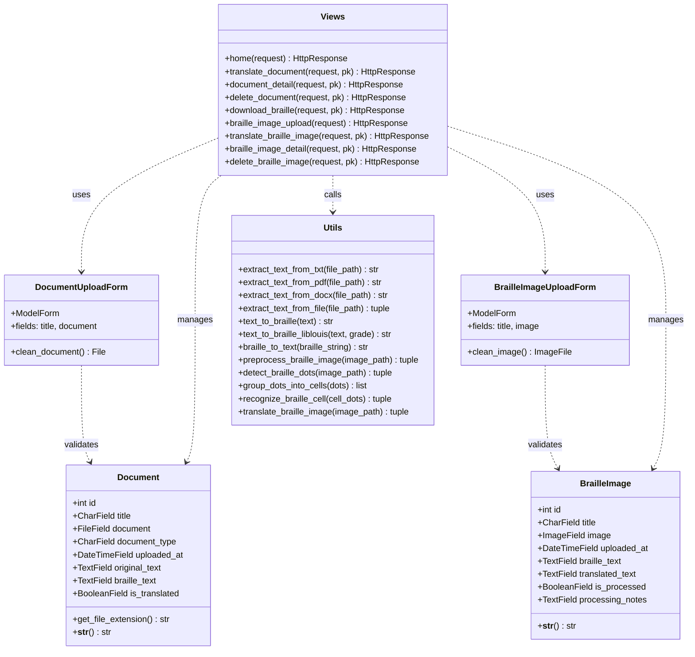
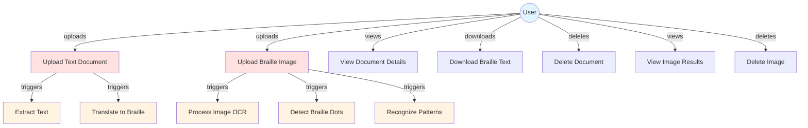
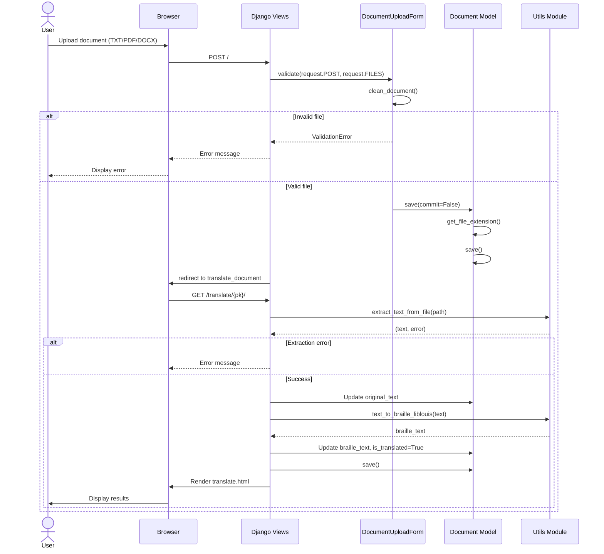
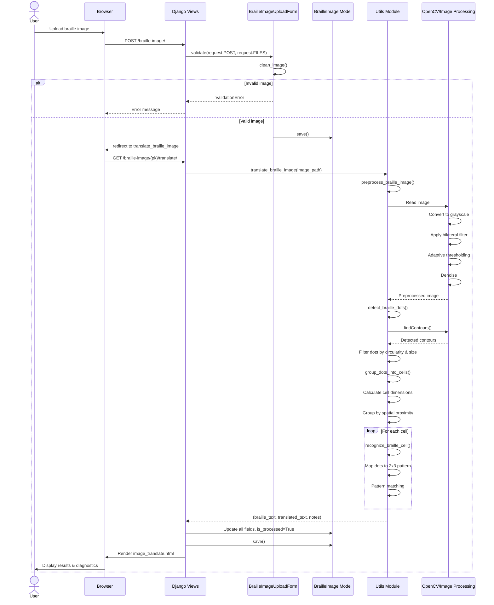
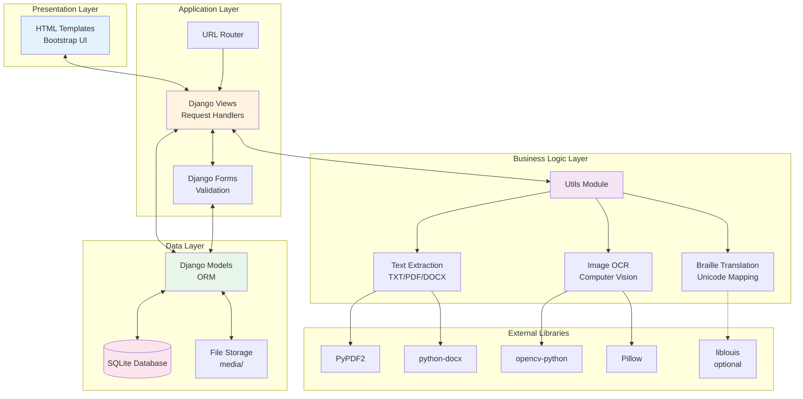
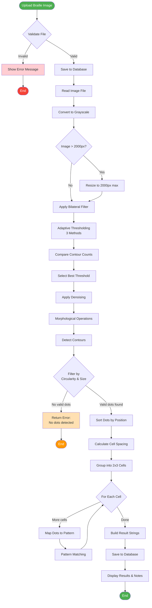
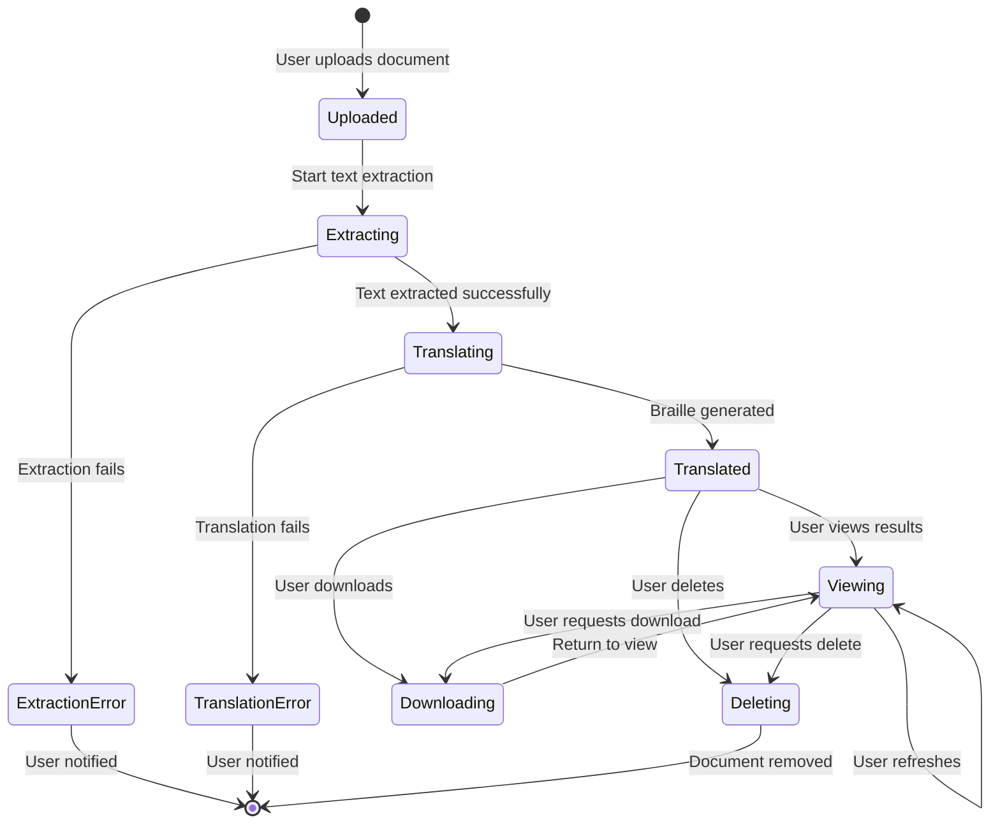
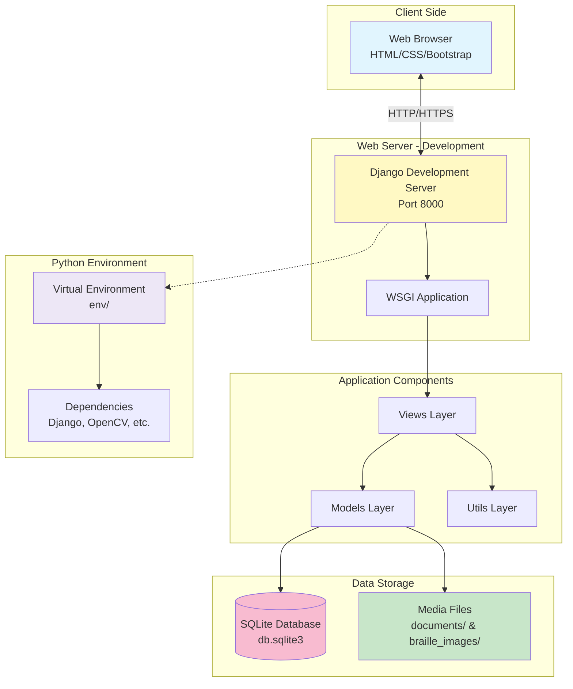

# UML Diagrams - Braille Translator Application

## 1. Class Diagram

## 2. Use Case Diagram

## 3. Sequence Diagram - Document Upload & Translation

## 4. Sequence Diagram - Braille Image OCR

## 5. Component Diagram

## 6. Activity Diagram - Image Processing Pipeline

## 7. State Diagram - Document Processing States

## 8. Deployment Diagram

## Diagram Descriptions

### Class Diagram
Shows the main models (`Document`, `BrailleImage`), forms (`DocumentUploadForm`, `BrailleImageUploadForm`), and their relationships with Views and Utils modules.

### Use Case Diagram
Illustrates all user interactions with the system, from uploading documents to viewing results and managing data.

### Sequence Diagrams
- **Document Upload**: Shows the complete flow from file upload through validation, text extraction, and Braille translation
- **Image OCR**: Details the complex image processing pipeline including preprocessing, dot detection, and pattern recognition

### Component Diagram
Displays the layered architecture: Presentation → Application → Business Logic → Data Layer, with external library dependencies.

### Activity Diagram
Visualizes the step-by-step image processing workflow with decision points and error handling.

### State Diagram
Represents the lifecycle of a document from upload through various processing states to final deletion.

### Deployment Diagram
Shows the runtime architecture with Django development server, database, file storage, and virtual environment setup.

---

## Notes
- These diagrams use Mermaid syntax and can be rendered in GitHub, VS Code (with Mermaid extensions), or any Mermaid-compatible viewer
- For production deployment, the deployment diagram would include NGINX/Apache, Gunicorn/uWSGI, and PostgreSQL instead of development components
